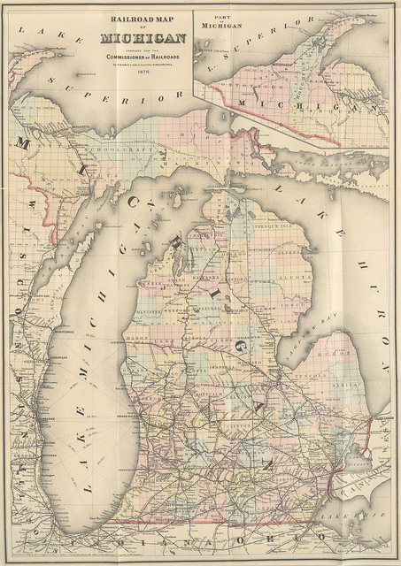

# Configuring a Laptop with Ansible

by Scott Vokes ([\@silentbicycle](https://github.com/silentbicycle/))

# Setting up custom environments

#
- Configuration Management
- Using Ansible
- Configuring an OSX laptop

# **Configuration Management**

# Configuration Management

- chef
- puppet
- ansible
- your favorite tool (I forgot)

# What To Do  vs. How to Get There

<!--
shell scripts give the program a series of instructions.
error handling?

CM tools give the program a map, an address, and a bus pass.
They'll figure it out.
-->

#

<!--
https://www.flickr.com/photos/britishlibrary/11113292726/
Credit: Flickr, The British Library
-->

# **Ansible**

# Ansible

- server-less
- based on SSH and Python

# Modules

    $ ansible -m ping localhost

# Modules

    localhost | success >> {
        "changed": false, 
        "ping": "pong"
    }

# Modules

    $ ansible -m apt
      -a "name=cowsay state=present" localhost

# Modules

    $ ansible -K -m apt
      -a "name=cowsay state=present" localhost

For when you need sudo.

# Docs

- `ansible-doc -l | --list`
- `ansible-doc file`

# Template module

Uses jinja2 templates, e.g. '{{variable}}'

    - template: src=foo.j2 dest=/etc/file.conf
      owner=bin group=wheel mode=0644

# Playbooks

- run sequentially
- can run on multiple hosts
- can include other stuff

# YAML

    - name: YAML example
      dict:
        property: not Turing-complete
        some_list:
          - stuff
          - more stuff

# Facts

#

<!--
https://www.flickr.com/photos/nationaalarchief/4193509648/
Credit: Flickr, Nationaal Archief
-->

# Inventory

- `hosts` file

# Inventory

    localhost

# Inventory

    localhost

    [group]
    name1
    name2
    etc

# An example playbook

# 
    ---
    - hosts: servers
      tasks:
      - name: install cowsay
        sudo: yes
        when: ansible_os_family == "Debian"
        apt:
          name: cowsay
          state: present
          
      - include: install_ssh_keys.yml

# Running Playbooks

    $ ansible-playbook -i hosts playbook.yml

# Running Playbooks

    $ ansible-playbook -i hosts -K playbook.yml

Again, for when some tasks need sudo.

# Playbook options

- `--syntax-check`
- `--check` (dry run)
- `--list-tasks` and `--list-hosts`
- `--start TASK_NAME`

# Roles

<!-- 
- modularity / reuse
- kind of like Chef cookbooks
-->

#

<!--
https://www.flickr.com/photos/wwworks/251970855/
Credit: Flickr, woodleywonderworks
-->

# Roles

    ---
    - hosts: servers
      roles:
      - common
      - firewall
      - { role: irc, when: irc_server is defined }

# Roles

- `roles/ROLE_NAME/`
- `tasks/main.yml`
- `templates/`
- `handlers/`
- etc.

# Host and Group Variables

- `host_vars/HOSTNAME` -> YAML file
- `group_vars/HOSTNAME` -> YAML file

# **Configuring a laptop**

# Linux, OSX, or BSD

# Packaging

- apt, yum, pacman, ...
- homebrew & homebrew_cask
- pkgng, openbsd_pkg, ...

# (Windows?)

- win_*

# Getting started (OSX version)

# Open the laptop

# Select language & keyboard layout

# Get on the wifi

# Get the playbook

    $ git clone ssh://YOUR_HOST/PATH

- May install Command Line Tools

# Bootstrap script

Run `bin/bootstrap_osx`

- Install homebrew
- (Should have Command Line Tools by now)
- Install Ansible

# Link paths

- `bin/link_paths` (optional)

# SSH keys

#

<!--
https://www.flickr.com/photos/josephleenovak/5559755789/
Credit: Flickr, josephleenovak
-->

# SSH keys

Run `bin/setup_ssh_key` (optional)

- Enable "remote login" if using SSH
- Ensure that `ssh localhost` works without a password
- Otherwise, use `-c local`

# Run the Playbook

- Took 15-20 minutes the first time
- Maybe < 20 seconds after
- May need to type password a few times

# OSX packages

- homebrew
- homebrew_cask

# homedir in git

["Configuring a Git-Controlled Home Directory with Ansible"](https://spin.atomicobject.com/2015/02/21/ansible-git-directory/)

# Recovering from Mistakes

    $ ansible-playbook --start RESUME_AT

# Details

- [https://github.com/atomicobject/ansible-laptop-playbook-example](https://github.com/atomicobject/ansible-laptop-playbook-example)
- Configuring a Laptop with Ansible, Parts [one](https://spin.atomicobject.com/2015/09/21/ansible-configuration-management-laptop/) and [two](http://spin.atomicobject.com/2015/09/22/ansible-config-example/)

# **Thanks**

# Questions?
